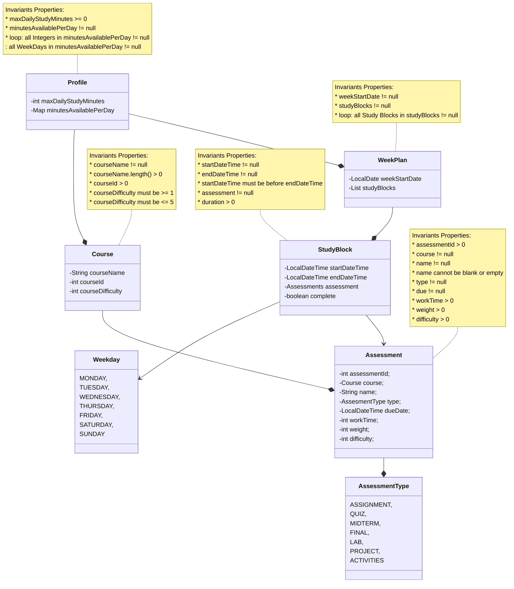

# Title: Smart Study Planner 

## Author: Thanni Obafunsho (thannio@myumanitoba.ca)

## Date: Winter 2026

# Running

* The functional application can be started by running the `main` method in

## Domain Model

### Here is the diagram for my model

